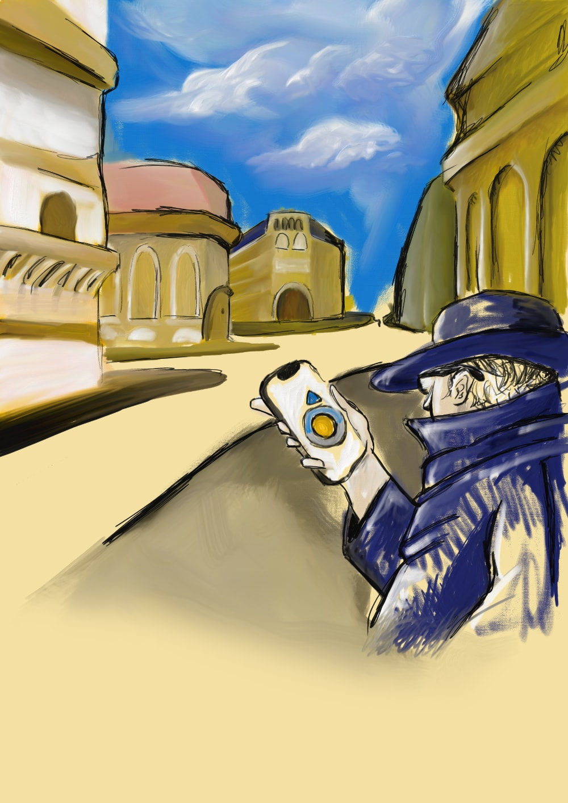

# Chickpeas 🍗 - Flanear

**Flanear** is an app created by the team called **Chickpeas 🍗**.

It is an app that helps Causual Walking Traveles who want to visit a new city without route constraints.

  
  

## App Statement

**Our** Application **helps** Casual Walking Travelers **who want to** visit a new city without route contraints **by** letting the use visit a new city freely **and** discovering new places without following a predefined route

  

## HiFi Prototype

You can find the Sketch prototype [here TODO](TODO-).

  

## Creators

* **Matilde** Cotroneo
* **Vincenzo** Esposito
* **Mattia** Fochesato
* **Giovanni** Imparato
* **Marco** Pescosolido
